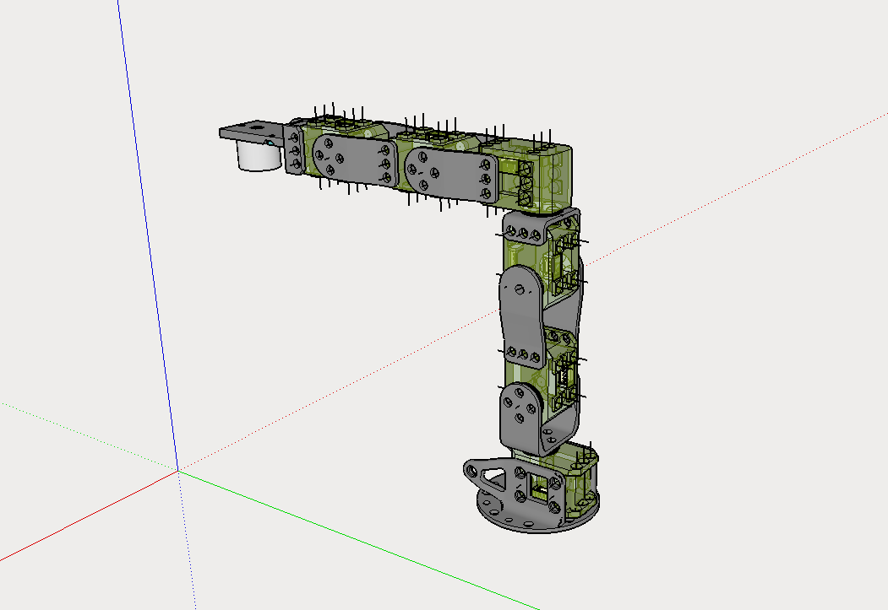
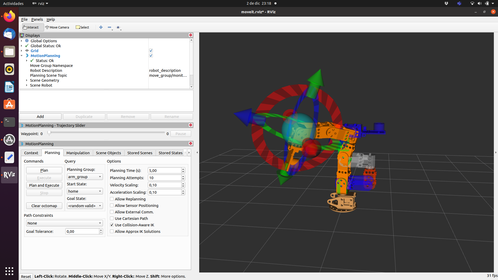
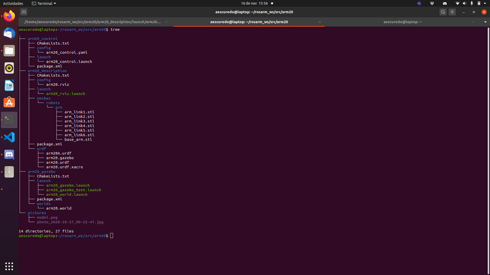

# Arm base in ROS #

This repository hosts the source code for the ROS < arm20 > package with the model of arm base in the Ergo Jr robot. With the modification that we have installed an electromagnet in the last joint to be able to manipulate small metal parts.

This is part of the practices that I am doing in the course MAstering Robot orerating System ROS in the ROBOCADEMY


## Key concepts covered ##
- The goal of this app is to practice with urdf and xacro, and implement it in gazebo to simulate.
- Create a model base in the stl.
- Create a xacro:macro




## Update ##

Add arm20_moveit following the tutorial and the SetupAssistant, I have managed to add the moveit to the arm model.




rebuilt the package in the correct format and fixed some bugs. now we have three folders:

-arm20_description

-arm20_gazebo

-arm20_control




## Usage ## 


To use the `arm20` package clone this repository into the `src` folder of your catkin workspace.

Then build the workspace with `catkin_make`.


In arm20.urdf.xacro can change the scale, the model was create in mm


roslaunch arm20_description arm20_rviz.launch --> to view the arm20.urdf.xacro model in rviz

roslaunch arm20_gazebo.launch   --> to view the arm.xacro model in gazebo.

roslaunch arm20_control arm_control.launch --> to start the control 

## Issues solved ##

-The model does not have the origins well placed, I have created some auxiliary links and auxiliary joints between the links to make it easier to assemble and articulate.

-With the coordinates of the model well, it is not necessary, but it is advisable to create an auxiliary link to visualize the position of the joint in the Preview URDF. 

- 
You have to add in all link fixed or not 
```ruby
   <inertial>
            <origin xyz="${origin_linkX_xyz}" rpy="0.0 0.0 0.0"/>
            <mass value="1.0"/>
            <inertia ixx="0.01" ixy="0.0" ixz="0.0" iyy="0.01" iyz="0.0" izz="0.01"/>
   </inertial>
 ```  
        


