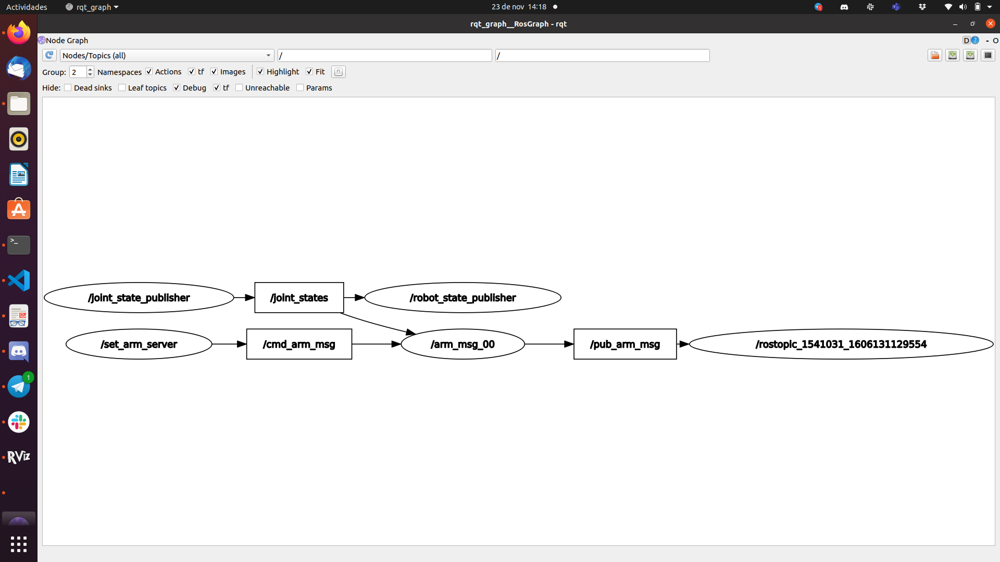
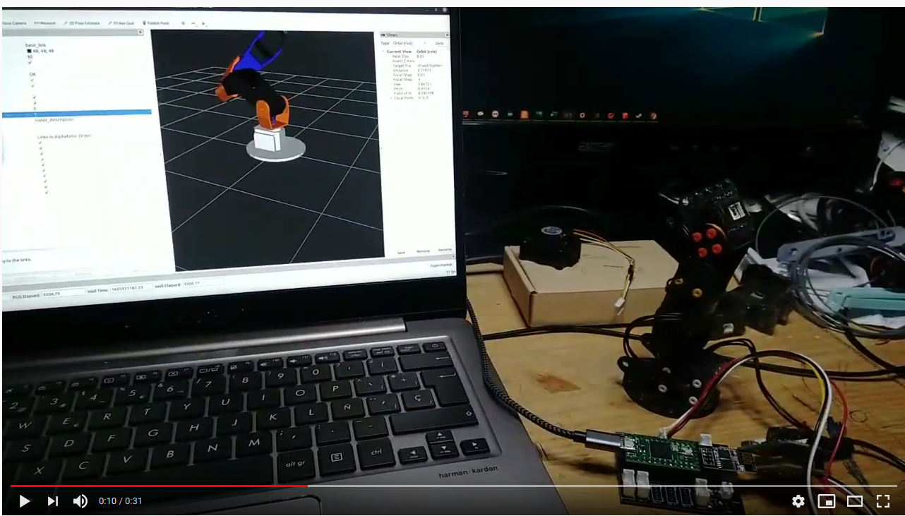

# Arm base in ROS #

This repository hosts the source code for the ROS < arm20 > package with the model of arm base in the Ergo Jr robot. With the modification that we have installed an electromagnet in the last joint to be able to manipulate small metal parts.

This is part of the practices that I am doing in the course MAstering Robot orerating System ROS in the ROBOCADEMY


## Key concepts covered ##
- The goal of this app is to practice with urdf and xacro, and implement it in gazebo to simulate.
- Create a model base in the stl.
- Create a xacro:macro


## Update ##

Add arm20_moveit following the tutorial and the [SetupAssistant](https://ros-planning.github.io/moveit_tutorials/doc/setup_assistant/setup_assistant_tutorial.html), I have managed to add the moveit to the arm model. 


Add arm20_msg and arm20_srv.

The arm does not have ROS, it is controlled with a Teensy 4.0 with an ESP8266 that receives the orders by UDP. I have created a service that receives the status of the / joint_states generated by the Rviz and converts it into orders for the arm through the topic / cmd_arm_msg that is sent by UDP.



The first test the service sent the order by UDP. It worked, but it stopped reading the status of the robot.

[](https://www.youtube.com/watch?v=GeI4ELki3co&feature=youtu.be)


##### Previous update #####
rebuilt the package in the correct format and fixed some bugs. now we have three folders:

-arm20_description

-arm20_gazebo

-arm20_control


## Usage ## 


To use the `arm20` package clone this repository into the `src` folder of your catkin workspace.

Then build the workspace with `catkin_make`.

In arm20.urdf.xacro can change the scale, the model was create in mm


   roslaunch arm20_description arm20_rviz.launch --> to view the arm20.urdf.xacro model in rviz

   roslaunch arm20_gazebo.launch   --> to view the arm.xacro model in gazebo.

   roslaunch arm20_control arm_control.launch --> to start the control 

##### Rviz service demo #####

If you don't have the robot and you want to test that it sends the commands by udp, modify the ip, the port.In the future I hope to make the control that moves the simulator, but the gazebo model does not work well. Maybe with another model.

   roslaunch arm20_description arm20_rviz.launch

   rosrun arm20_srv arm_ros_00.py    # make sure are executable

   rosrun send_arm_server.py

##### Moveit #####
I want to be able to give it a goal position x, y, z through a camera and let moveit do the inverse kinematics calculations to move the arm.


   roslaunch arm20_moveit demo.launch   

   roslaunch arm20_moveit demo_gazebo.launch              In gazebo the arm not respond
   

## Issues solved ##

-The model does not have the origins well placed, I have created some auxiliary links and auxiliary joints between the links to make it easier to assemble and articulate.

-With the coordinates of the model well, it is not necessary, but it is advisable to create an auxiliary link to visualize the position of the joint in the Preview URDF. 

- 
You have to add in all link fixed or not 
```ruby
   <inertial>
            <origin xyz="${origin_linkX_xyz}" rpy="0.0 0.0 0.0"/>
            <mass value="1.0"/>
            <inertia ixx="0.01" ixy="0.0" ixz="0.0" iyy="0.01" iyz="0.0" izz="0.01"/>
   </inertial>
 ```  
 
 the arm in gazebo falls: the error was that it used EffortJointInterface and it should use the PositionJointInterface
 
 
 

 


